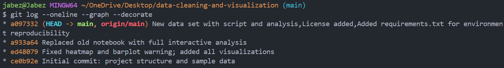

# Data Cleaning and Visualization

This project demonstrates basic data cleaning and visualization using Python.  
It is developed as part of my Git & GitHub assignment in the MSc Data Science program.

## Structure
- **data/** → contains sample CSV dataset
- **scripts/** → Python script for cleaning the data
- **notebooks/** → Jupyter notebook for visualization
- - `plots/` → Contains generated visualization images

## Requirements
- Python 3
- pandas
- matplotlib

## Usage
1. Run `scripts/clean_data.py` to clean the dataset.
2. Open `notebooks/analysis.ipynb` to visualize the cleaned data.

## Git Log Proof
Below is the screenshot showing my Git commit history for this project:

