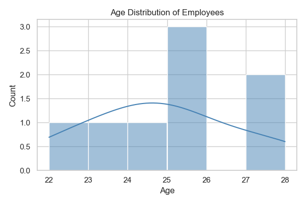
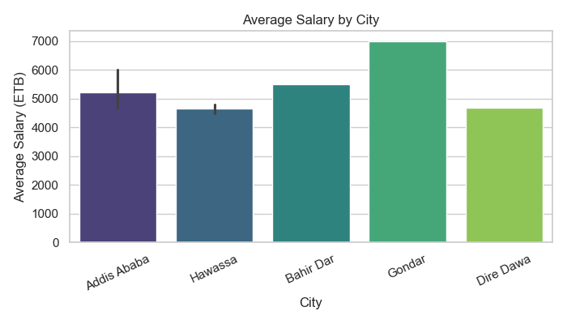
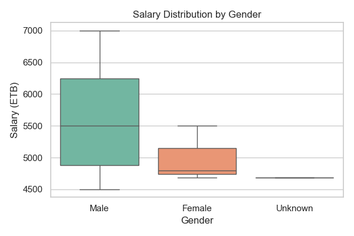
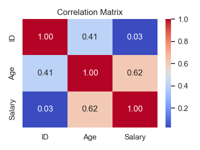

# 🧹 Data Cleaning and Visualization

This project demonstrates **basic data cleaning and visualization using Python**.  
It was developed as part of my **Git & GitHub assignment** in the **MSc Data Science** program at **Addis Ababa University**.

---

## 📄 Project Overview

The main goal of this project is to show how **raw, unstructured data** can be transformed into **clean and meaningful information** through systematic cleaning and visualization techniques.  
It also showcases how version control using **Git** and **GitHub** supports collaborative and organized software development.

### ✳️ Key Features
- Cleaning and preprocessing raw CSV data using **Pandas**  
- Handling missing values, duplicates, and incorrect data types  
- Generating summary statistics for quick analysis  
- Visualizing the cleaned data using **Matplotlib** and **Seaborn**  
- Organized project structure following best practices  
- Git log showing a clear workflow of commits and repository management

---

## 🗂️ Project Structure

**Folders and Files**
```
data-cleaning-and-visualization/
│
├── data/ → Contains the sample CSV dataset
├── scripts/ → Python scripts for data cleaning
│ └── clean_data.py
│ └── visualize_data.py`
├── notebooks/ → Jupyter notebook for visualization
│ └── analysis.ipynb
├── plots/ → Contains generated visualization images
├── git_log_screenshot.png → Git log screenshot proof
├── requirements.txt → Required Python libraries
└── README.md → Project documentation

```
---

## ⚙️ Technologies & Requirements

- **Python Version:** 3.x  
- **Libraries Used:**
  - `pandas` – for data manipulation and cleaning  
  - `matplotlib` – for data visualization  
  - `seaborn` – for advanced visualizations  
  - `os` – for handling file paths

---

Install required libraries:

```bash
pip install pandas matplotlib

```

```bash
pip install pandas matplotlib seaborn

```
---

##  Usage with how to run 

How to Run the Project
```
git clone https://github.com/Yabets-art/data-cleaning-and-visualization.git
cd data-cleaning-and-visualization

```

---

### 1: Data Cleaning

Run the cleaning script to process the raw dataset:

 Run `scripts/clean_data.py` to clean the dataset.

This script:

  - Reads the raw data from `data/sample_data.csv`

  - Removes inconsistencies (e.g., duplicates, capitalization)

  - Saves a clean version to `data/cleaned_data.csv`


#### 🧾 Before and After Data Cleaning

<table> <tr> <th>🔹 Before Cleaning</th> <th>🔹 After Cleaning</th> </tr> <tr> <td> <ul> <li>Missing values in several columns.</li> <li>Inconsistent formats (e.g., text instead of numbers).</li> <li>Duplicate records.</li> <li>Outliers that distort visualization.</li> </ul> </td> <td> <ul> <li>All missing values handled or filled appropriately.</li> <li>Data types standardized.</li> <li>Duplicates removed.</li> <li>Clean and structured data ready for visualization.</li> </ul> </td> </tr> </table>

---

### 2: Data Visualization

After cleaning, visualizations such as bar charts and histograms are generated to provide meaningful insights into the dataset.
All generated images are automatically saved in the plots/ directory.

Run the visualization script to generate visual insights:

 Run `python scripts/visualize_data.py` to visualize the dataset.


This creates several charts (saved automatically under plots/):

<table>
  <tr>
    <td></td>
    <td></td>
  </tr>
  <tr>
    <td></td>
    <td></td>
  </tr>
</table>


---

### 3. Interactive Notebook

Open `notebooks/analysis.ipynb` to visualize the cleaned data.

or  `jupyter notebook notebooks/analysis.ipynb`

The notebook provides:

  - Inline tables and summary statistics

  - Interactive plots using matplotlib and seaborn

  - Step-by-step explanations of data cleaning and visualization

---

### 📊 Results & Discussion

The analysis produced several visual insights:

  - Age Distribution shows most individuals are between 22–28 years old.

  - Salary by City indicates higher salaries concentrated in Addis Ababa.

  - Gender Ratio visual reveals a balanced but slightly male-dominant dataset.

  - Correlation Matrix highlights a positive relationship between Age and Salary.

  - These findings demonstrate how data cleaning improves analytical accuracy and clarity in visualization.

---

## Git Log Proof
Below is the screenshot showing my Git commit history for this project:


---


## 🤝 Contributing

Contributions are welcome! To contribute:

  - Fork the repository

  - Create a new branch for your feature (git checkout -b feature-name)

  - Commit your changes (git commit -m "Add feature")

  - Push to the branch (git push origin feature-name)

  - Open a Pull Request


## 📄 License

This project is licensed under the MIT License Copyright (c) 2025 Yabets Desalegn


## 🙏 Acknowledgments

  - Python libraries: pandas, matplotlib, seaborn

  - Jupyter Notebook for interactive development

  - Git & GitHub workflow tutorials for version control best practices


## 👤 Author

Name: Yabets Desalegn

Program: MSc Data Science

University: Addis Ababa University

Year: 2025
